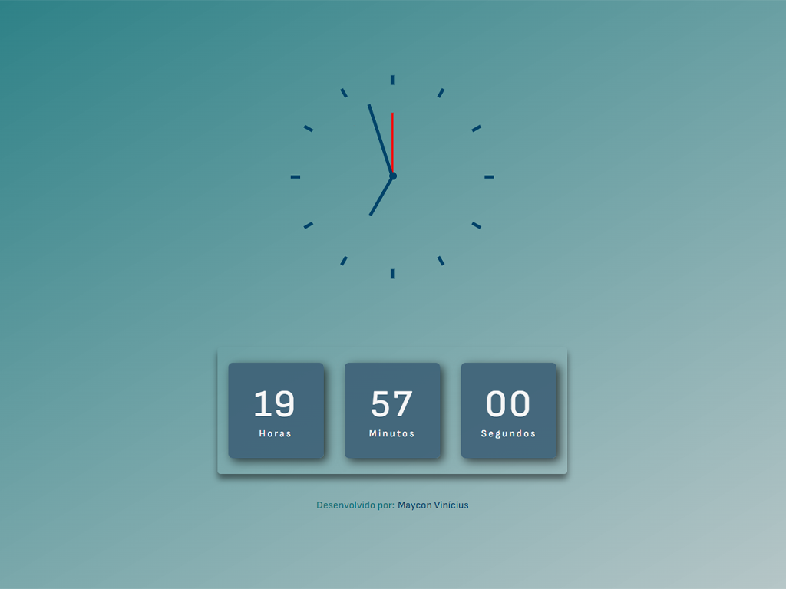

## Projeto relógio analógico e digital.
- O mesmo é uma adaptação do projeto inicial do curso de Javascript da B7WEB.
- Tecnologias usadas nesse projeto.
    

        
        
        
        
    

## Projeto Finalizado.
